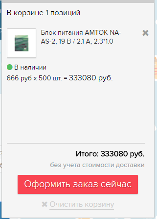

# Ecommerce arch

# Глоссарий

**Вьюшка (View)** - часть архитектурного концепта MTV (Model, Template, View). Вьюшка принимает http-запрос с его параметрами и превращают этот запрос в ответ. Для этого обычно ходит в базу.

*Пример*

*Во вьюшку прилетел запрос с путём: /catalog/products/3497/. Из этого запроса вьюшка понимает, что нужен продукт (products) с номером id=3497, и искать его нужно в каталоге (catalog). Для этого вьюшка идёт в базу, достаёт данные этого продукта, втыкает их в html-шаблон и возвращает в качестве ответа готовый html.*

*[Результат работы вьюшки в чистом виде.](https://www.shopelectro.ru/catalog/products/3497/.)*

# Общее

Ecommerce – python-модуль приложения Refarm-site.

Функциональность Ecommerce позволяет:
* работать с базой товаров:
  * скачать выгрузку базы товаров и парсить затронутые (добавленные или изменённые в 1С) продукты и их характеристики;
  * добавить/удалить/обновить затронутые продукты и их характеристики;
  * обновить прайс-листы:
    * для Яндекс.Маркета;
    * в формате Excel;
* работать с корзиной:
  * добавить товары;
  * хранить содержимое корзины между http-сессиями;
  * превратить содержимое корзины в заказ;
  * следить за скидками;
* работать с заказом:
  * через Яндекс.Кассу:
    * формировать данные для оплаты;
    * проверять платежи;
* рассылать почтовые уведомления после совершённого заказа:
  * менеджеру магазина;
  * покупателю;
  * в базу для резервирования.

## Работа с базой товаров

1C формирует выгрузку базы товаров в формате .xml и помещает её в определённой директории на Windows Server’е (контролируемым бизнесом). Выгрузка скачивается по ftp.

*Примечание: в случае проблем с ftp или Windows Server’ом обращайтесь к Хелхи.*

Чтобы выгрузка из 1С оказалась в своей базе, запустите на сервере команду "dcp exec se-python python manage.py update_db".

*Примечания:*
1. Команда "update_db" запускается по крону (crone) раз в 2 часа.
2. Из базы достаём только товары. Структура категорий на сайте своя. Из-за этого неприятное следствие: когда в 1С добавляют товары, в базу сайта они заезжают без родительской категории. Контентщикам приходится добавлять их руками.
3. Обновление прайс-листов для Яндекс.Маркета и в формате Excel обычно происходит так же по крону сразу после обновления каталога.
4. Сценарий использования прайс-листа в формате Excel: оптовый покупатель по линку “Скачать прайс” на Главной странице скачивает прайс, проставляет в нём нужное количество единиц товара и высылает его нам на почту.

## Определение оптовой скидки

Всего есть 5 видов цен:
1. Закупочная цена (R). Вносится в базу 1С вручную.
2. Розничная цена (S). Вносится в базу 1С вручную.
3. Оптовые цены:
  * мелкий опт: S1 = S х k1;
  * средний опт: S2 = S х k2;
  * крупный опт: S3 = S х k3,

 где k1, k2, k3 - коэффициенты оптовой цены.

*Примечание: определение значений S1, S2, S3 происходит на стороне 1С.*

Также есть пороговые значения для оптовых цен, при превышении которых применяется оптовая скидка:
* мелкий опт (B1), руб: 20000;
* средний опт (B2), руб: 50000;
* крупный опт (B3), руб: 100000.

У каждой корзины есть:
* 4 цены:
  * 1 розничная (S);
  * 3 оптовых (S1, S2, S3);
* 3 пороговых значения цены (B1, B2, B3).

Алгоритм определения итоговой цены заказа такой:
* если S3 > B3, значит в корзине крупный опт. Назначаем каждому товару цену крупного опта и завершаем алгоритм;
* если S2 > B2 - средний опт, аналогично;
* если S1 > B1 - мелкий опт, аналогично;

иначе - оставляем розничные цены S.

*Пример 1*

*Пользователь указал количество: 500 шт. Расчёт по розничной цене: 500 х 1111 = 555500 руб. 555500 > 100000, поэтому расчёт идёт по цене 666,16 руб за единицу. Итоговая цена: 500 х 666,16 = 333080 руб.*

*Пример 2*

*Возьмём товар - блок питания: https://www.shopelectro.ru/catalog/products/2805/. Закажем 26 шт. Видим в корзине это: 1111 руб х 26 шт. = 28886 руб. Очистим корзину. Закажем 27 шт. Видим в корзине это: 767 руб х 27 шт. = 20717 руб. Получается, мы можем купить 27 одних и тех же блоков дешевле, чем 26.*

# Код

Универсальные сущности лежат в refarm-site/ecommerce. Чтобы их использовать, мы наследуемся от них в своём проекте и расширяем их.

*Примеры*

*1. В SE частично переопределяем базовую модель корзины - используем пересчёт цены в зависимости от объёма закупки: https://github.com/fidals/shopelectro/blob/master/shopelectro/cart.py.*

*2. В SE в базовую модель заказа добавляем несколько полей:
https://github.com/fidals/shopelectro/blob/master/shopelectro/models.py#L114.*

*3. В SE переопределяем шаблон письма рассылки:
https://github.com/fidals/shopelectro/blob/master/templates/ecommerce/order/email.html.*

Вьюшки:
* [стандартные для моделей заказа и корзины](https://github.com/fidals/refarm-site/blob/master/ecommerce/views.py);
* [формирующая данные для оплаты через Яндекс.Кассу](https://github.com/fidals/shopelectro/blob/master/shopelectro/views/ecommerce.py#L93) (этап №2 из [схемы платежа](https://tech.yandex.ru/money/doc/payment-solution/payment-process/payments-receipt-docpage/));
* сервисная, для проверки платежей Яндекс.Кассы (этап №5 из [схемы платежа](https://tech.yandex.ru/money/doc/payment-solution/payment-process/payments-receipt-docpage/)).
